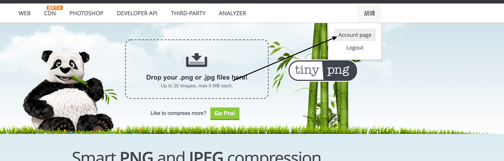
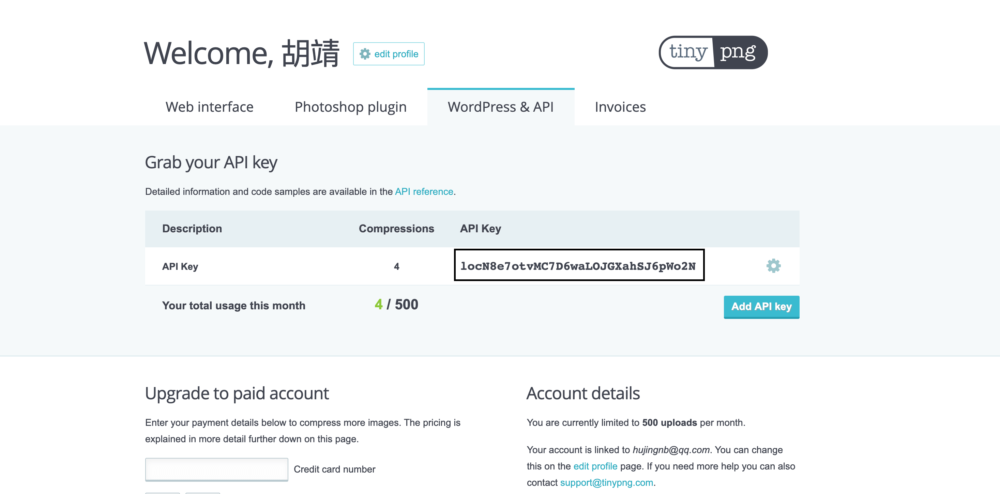

将markdown文件中的图片转换成base64编码

**提示**

因本人改为使用: typore+PicGo+oss 进行文章的图片管理, 暂时没有对此项目使用的需求了, 故暂时停止更新. 

若你在使用时, 碰到问题, 可以提 issuse 给我, 有时间我会加上的

## 你们在使用markdown的时候有没有这样的烦恼? 

* 文本中的图片保存在本地, 如果给别人发送markdown文件就要连文件夹一起发送, 而且还要担心路径不要出错
* 文本的图片保存在本地, 编辑完成后想将编辑好的md发布到博客, 但是你发现本地文件不能粘贴
* 图片保存到服务器, 如果哪天服务器一关, 我之前的所有图片都没了

基于此, 我写了这样一个脚本, 方便自己也方便他人

这个脚本可以将你的md文件中所有图片进行压缩后base64编码, 直接写道markdown文件中, 再也不用担心图片路径什么的了, 你可以在本地进行编辑, 编辑完成后运行脚本一键转换

还有, 这个脚本目前处于初级阶段, 也欢迎大家一起来找茬..

## 使用介绍

下载后执行

`python main.py -h`

查看帮助文档, 如果要压缩图片, 请将 配置文件中的 tinify_key 更换为你自己的

目前压缩图片仅有tinypng一个, 可以自由添加多个

### tinify_key 获取方式

打开网站: [https://tinypng.com/](https://tinypng.com/) 注册账号. 打开个人账号页面. 

再个人页面找到自己的key, 每个账户每月有500张. 如果没有显示key, 申请一个就好了

